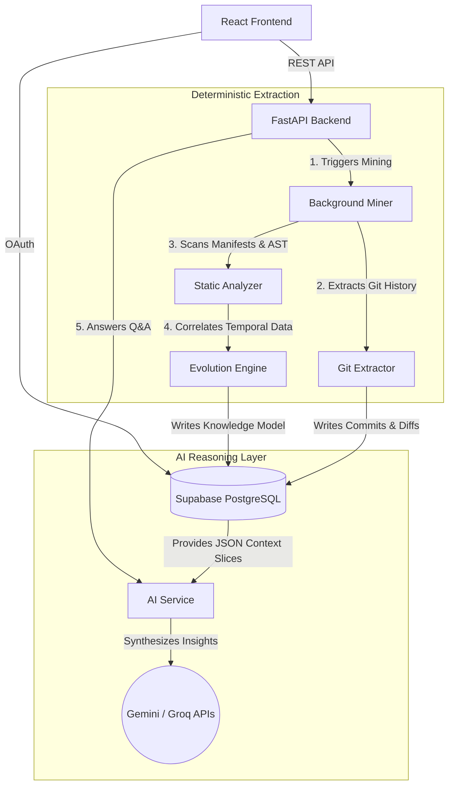

# GIT Compass

> Transform a GitHub repository's raw Git history into analytical intelligence.

GIT Compass is a full-stack developer tool designed for developers onboarding to unfamiliar codebases and tech leads conducting architectural audits. Unlike tools that analyze what code currently *is*, this platform analyzes how it *evolved*.

## Key Features

- **High-Speed Git Extraction:** Utilizes blobless cloning and bulk streaming (`git log --numstat -M`) to quickly process massive repositories.
- **Repository Structural Analysis:** Automatically detects languages, frameworks, and structural components via deterministic static analysis.
- **Dependency Tracking:** Safely parses manifest files (`package.json`, `requirements.txt`, `docker-compose.yml`, etc.) to map out the tech stack, explicitly redacting all secrets and environment values.
- **Architectural Evolution Engine:** Deterministically groups code and git events into logical historical phases (e.g., "Foundation", "Expansion") to build a chronological timeline of your architecture.
- **AI-Powered Q&A:** A context-aware conversational interface powered by LLMs (with a robust Gemini/Groq multi-provider fallback) that synthesizes highly accurate answers to your codebase questions based on hard historical evidence.
- **Hotspots & Temporal Coupling:** Identifies high-churn files and calculates co-change matrices to reveal hidden dependencies between modules that frequently change together.
- **Knowledge Concentration:** Evaluates code ownership and developer churn to calculate a repository "Bus Factor" and flag knowledge silos.

## Tech Stack

| Layer | Technology |
|-------|-----------|
| Frontend | React (Vite), Tailwind CSS v4, React Flow, Recharts |
| Backend | FastAPI (Python), Pydantic |
| Database & Auth | Supabase (PostgreSQL + Auth) |
| Git Layer | GitPython / subprocess |
| AI Layer | Gemini API & Groq API (Multi-provider Fallback, Phase 8) |

## Getting Started

### Prerequisites

- **Node.js** ≥ 18 (recommend 22 LTS)
- **Python** ≥ 3.11
- **Supabase project** with GitHub OAuth configured (see below)

### 1. Clone & Configure

```bash
# Server / Backend
cp server/.env.example server/.env
# Edit server/.env with your Supabase credentials:
#   SUPABASE_URL, SUPABASE_ANON_KEY, SUPABASE_SERVICE_ROLE_KEY, SUPABASE_JWT_SECRET
#   GEMINI_API_KEY, GROQ_API_KEY (for AI features)

# Client / Frontend
cp client/.env.example client/.env
# Edit client/.env with:
#   VITE_SUPABASE_URL, VITE_SUPABASE_ANON_KEY
```

### 2. Set Up Supabase

1. Run all migrations in `server/supabase/migrations/` (001 through 011) in your Supabase Dashboard → SQL Editor.
2. Enable **GitHub** as an auth provider in Supabase Dashboard → Authentication → Providers.
3. Add `http://localhost:5173` to Supabase Dashboard → Authentication → URL Configuration → Redirect URLs.

### 3. Start the Backend (Server)

```bash
cd server

# Create and activate virtual environment
python -m venv .venv
# On Windows PowerShell:
.\.venv\Scripts\Activate.ps1
# On Linux/macOS:
# source .venv/bin/activate

pip install -r requirements.txt

# Run server with uvicorn
python -m uvicorn app.main:app --reload
```

The API will be available at `http://localhost:8000`. Docs at `http://localhost:8000/docs`.

### 4. Start the Frontend (Client)

```bash
cd client
npm install
npm run dev
```

Open `http://localhost:5173` — the Vite dev server proxies `/api` requests to FastAPI automatically.

## System Architecture

GitCompass is built on a strict separation of concerns: **Deterministic Extraction** (hard data) and **AI Reasoning** (soft synthesis). By relying on deterministic code analysis to build a structured graph of the repository, we avoid LLM hallucinations and use AI strictly for summarizing and correlating true events.



## Project Structure

```
GitCompass/
├── server/
│   ├── app/
│   │   ├── main.py           # FastAPI entry point
│   │   ├── config.py         # Pydantic settings
│   │   ├── database.py       # Supabase client factories
│   │   ├── dependencies.py   # JWT auth + DB dependencies
│   │   ├── routers/          # API endpoints (analytics, repositories, evolution, ai)
│   │   ├── schemas/          # Pydantic models
│   │   └── services/         # Core extraction & reasoning modules
│   │       ├── miner.py                # Mining orchestrator
│   │       ├── structure_analyzer.py   # Language/framework extraction
│   │       ├── dependency_analyzer.py  # Package manifest parsing
│   │       ├── source_analyzer.py      # Code AST extraction
│   │       ├── evolution_analyzer.py   # Git temporal correlation
│   │       ├── phase_analyzer.py       # Architectural phasing
│   │       └── ai_service.py           # Gemini/Groq orchestration & fallback
│   └── supabase/
│       └── migrations/       # SQL migrations (001 to 011)
├── client/
│   ├── src/
│   │   ├── App.jsx           # Auth-gated root
│   │   ├── lib/              # Supabase client & API helpers
│   │   ├── pages/            # Login, Dashboard, Analytics, Architecture, AI Insights
│   │   └── components/       # Layout, StatusBadge, HotspotTreemap, AIChatDrawer
│   └── vite.config.js        # Vite dev server + API proxy
└── README.md
```

## License

Private — all rights reserved.
